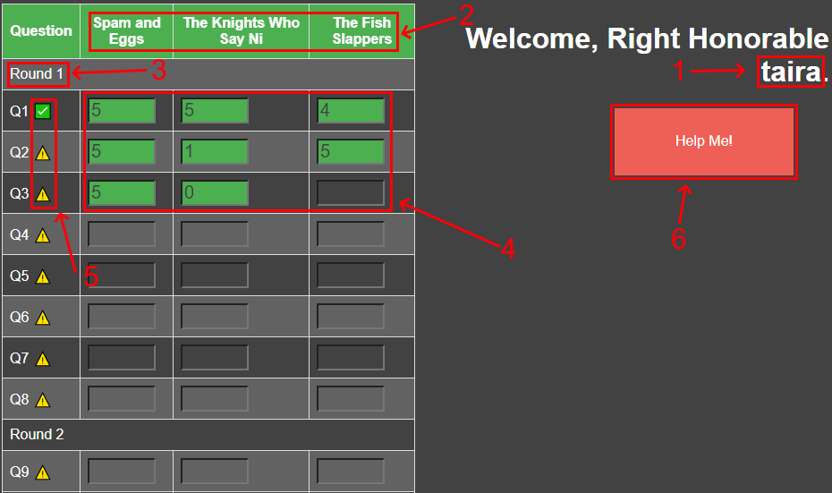

# How to Judge

The judging system is modeled after Microsoft Excel. It was designed to function more or less the same way the old system of scoring worked in order to make the process as straightforward as possible. Here's how it works:

- The URL which facilitates judging is `http://host:port/judge` where `host:port` is the IP address and port number specified in `conf.toml` by the systems administrator who sets the software up. (In other words, this information will be given to you. It will most likely be something like `192.168.1.10/judge` or something similar.)
-  When you navigate to the judge's page for the first time, you'll be presented with a login screen. Here, you must enter your username and password to log in. This information will be given to you before judging commences.
- Once you've logged in, you'll be presented with a page that looks a lot like Excel, with columns, one for each team you're responsible for, and rows, one for each question:

1. Your username is displayed here.
2. The team names head each column, and will follow you as you scroll down.
3. Each round is separated by a spacer.
4. Scores are entered here.
5. These icons indicate the status of the question. When all judges have entered an answer for a given question, it will be a green checkmark. Otherwise, it will be a yellow caution sign.
6. A help button is provided to signal that you need help. If pressed, it sends a signal to whoever is watching the scoring page that you need help.

To score, you must:

  -  place your cursor in the box of the question and team you want to score. You may optionally use `TAB` to move to the next cell.
  - Enter the score.
  - That's it.

  There is no save button. There's no need for one. The page is in constant communication with the server behind the scenes, so the second you enter the score, it has already been saved. There is no need to tally or add up scores either, as the server handles that as well. The hope is that by the end of the night, there will be no scramble to add up the scores and find the winning team. In fact, we should know the winning team as soon as the last score is entered.

## A Few Things to Look Out For
The system is designed to be as automatic and fool proof as it possibly can. That said, there are a few things to keep an eye out for. Though rare, knowing what to do in these situations is critical.

- **Invalid Scores** - It is not possible for an invalid score to be entered and saved into the database. The code which handles the transmission of the data from the page to the server checks to see that the score is one of `0`, `1`, `4` or `5`. If it is not any of those, an error message will pop up in the upper righthand corner informing you that you've made an invalid entry, and the box where you entered it will light up red. If this happens, you simply need to go back and correct your error.

- **Session Expired** - This in theory shouldn't happen, but in case it does...When you log in to the server, a "session" is created between you and the server to facilitate the necessary communication. It is possible for this session to expire, and if it does, an error message will pop up at the top center of the screen. If you get this error message, it will block you from entering any more scores because the line of communication has effectively been broken. Clicking "OK" on the popup will redirect you to log in again, and after that, you should be able to pick up scoring right where you were.
